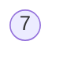
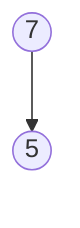
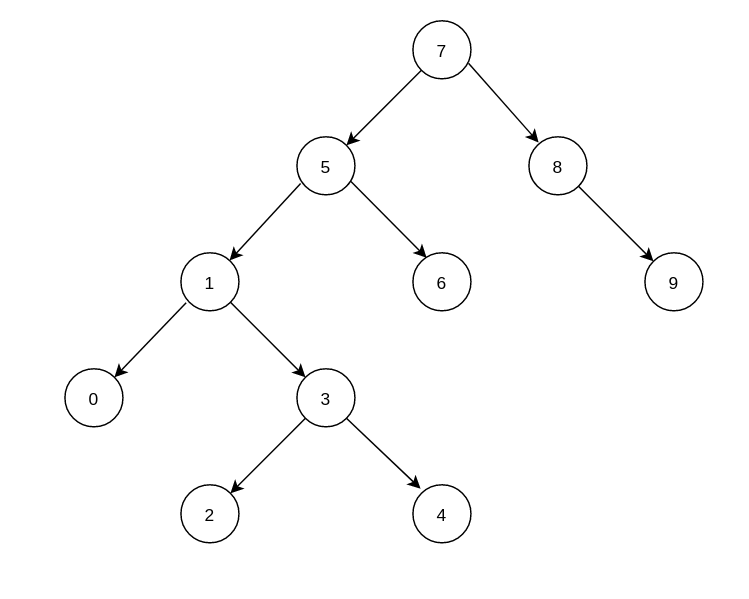

# Binary Search Tree

Binary Search Tree, düğümleri (node) özel bir şekilde düzenlenmiş veri yapıları olarak tanımlanabilir.
* Ağaçta root olarak belirlenen node'un sol tarafında rot node'dan küçük değerler yer alır.
* Benzer şekilde root node'un sağ tarafında root node'dan büyük  veya eşit değerler yer alır.
* Bu kural ağacın alt dallarında da aynı şekilde uygulanır.

|index|0|1|2|3|4|5|6|7|8|9|
| :----: | :----: | :----: | :----: | :----: | :----: | :----: | :----: | :----: | :----: | :----: |
|array|7|5|1|8|3|6|0|9|4|2|

* Yukarıda verilen dizide 0. indexte bulunan 7 değerini root node kabul edelim

* Ardından gelen 1. indexteki 5 değerinin root node'da küçük ya da büyük olduğunu değerlendirip, root node'un sol ya da sağ tarafına yerleştirelim.

* Ardından gelen 2. indexteki 1 değerinin root node'dan büyük ya da küçük olduğunu değerlendirdğimizde, root node'dan küçük olduğunu ve sola yerleştirilmesi gerektiğini görüyoruz. Bu değer bir alt node olan 5 değerinden de küçük olduğu için onun da soluna yerleştiriyoruz.

Yukarıda ki gösterimde görüleceği üzere root node olan 7'nin solunda kendisinden küçük olan değerler yer alırken sağında kendisinden büyük olan değerler yer alıyor. Benzer şekilde alt dallarda solda bulunan node'lar bir üzerindeki değerlerden küçük, sağda bulunan değerler bir üstlerindeki değerlerden büyük olacak şekilde er alıyor.

Binary Search Tree üzerinde diğer data yapılarında olduğu gibi search, insert, delete operasyonları yapılabilir. time complexity açsından değerlendirilirse;

|işlem|Best Case|Average Case|Worst Case|
|:----:|:----:|:----:|:----:|
|Search|O(log n)|O(log n)|O(n)|
|Insert|O(log n)|O(log n)|O(n)|
|Delete|O(log n)|O(log n)|O(n)|